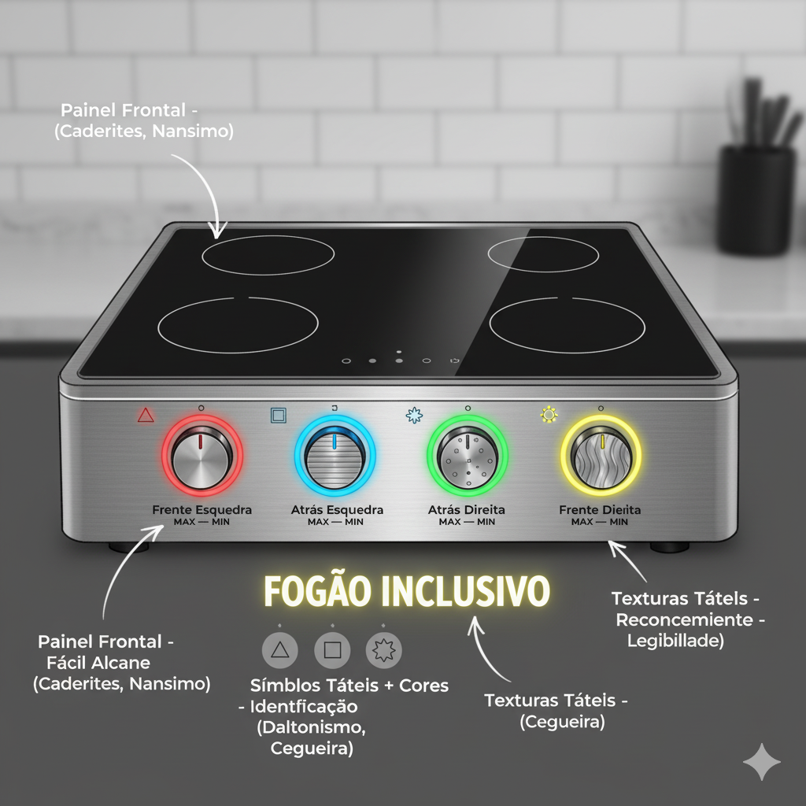

# Nova Interface do Fogão Acessível

## Descrição

Este projeto apresenta uma **interface de fogão acessível e inclusiva**, desenvolvida com foco em **design universal** e **usabilidade para todos**. O objetivo é tornar o uso do fogão seguro e intuitivo para pessoas com diferentes habilidades, incluindo deficiência visual, auditiva, mobilidade reduzida, daltonismo e dificuldades cognitivas.

O projeto incorpora recursos multimídia, como **instruções em áudio, vídeo com legendas e interpretação em Libras**, e utiliza elementos visuais, táteis e sonoros para maximizar a acessibilidade.

## Funcionalidades Principais

- Feedback sonoro para cada ação
- LEDs de status e cores diferenciadas
- Controles frontais e ajustáveis para cadeirantes
- Botões grandes e ergonomicamente posicionados
- Conectividade Bluetooth e comando de voz
- Manual em áudio e vídeo acessível

## Necessidades Especiais Atendidas

| Necessidade | Recurso |
|-------------|---------|
| Deficiência Visual 👁️ | Feedback sonoro, texturas nos controles, alto contraste visual |
| Deficiência Auditiva 👂 | LEDs de status, feedback visual e vibração |
| Daltonismo 🎨 | Controle remoto via celular ou comando de voz |
| Cadeirantes ♿ | Controles frontais acessíveis, espaço livre, Bluetooth e comando de voz |
| Nanismo/Gigantismo 📏 | Painel de altura ajustável, botões grandes e ergonomia flexível |
| Dificuldades Cognitivas 🧠 | Interface simplificada, instruções por voz passo a passo |

## Princípios de Usabilidade Aplicados

- **Perceptibilidade:** informações por múltiplos canais sensoriais  
- **Operabilidade:** controles acessíveis e posições ergonômicas  
- **Compreensibilidade:** interface intuitiva com linguagem clara  
- **Robustez:** compatível com tecnologias assistivas  

## Justificativa do Design

- **Cores:** diferenciáveis mesmo para daltonismo, significados universais de segurança  
- **Formas:** controles circulares de 6cm, fáceis de localizar  
- **Sons:** feedback sonoro único para cada ação  
- **Texturas:** superfícies rugosas e lisas seguindo padrões táteis da ABNT  

## Manual de Uso

O manual inclui:

- **Instruções em áudio:** narração em português com detalhes passo a passo  
- **Tutorial em vídeo:** com legendas e Libras  
- **Instruções passo a passo:** identificação de controles, acendimento, ajuste de temperatura e dicas de segurança  

## Footer

**Aluno:** Paulo Roberto – Outubro/2025
**Curso:** 	CPV.LAT.DSW.2024 - Especialização em Desenvolvimento de Sistemas Web e Aplicativos Móveis
**Disciplina:** Desenvolvimento para Internet I
